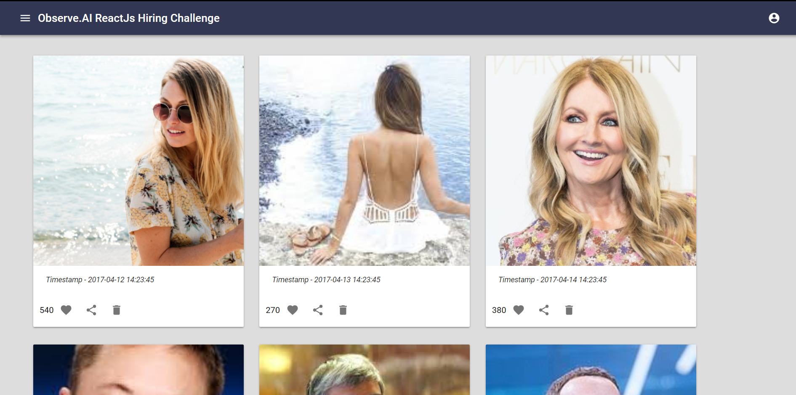
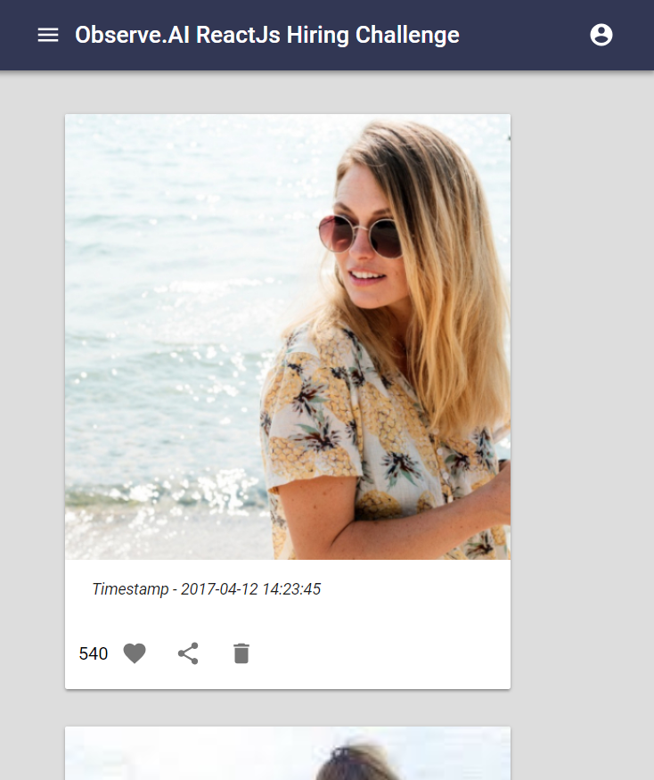
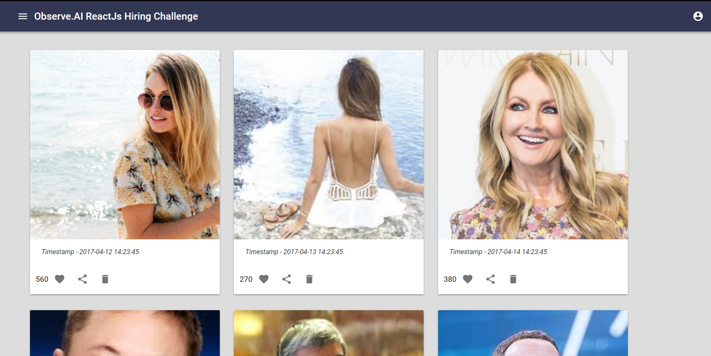
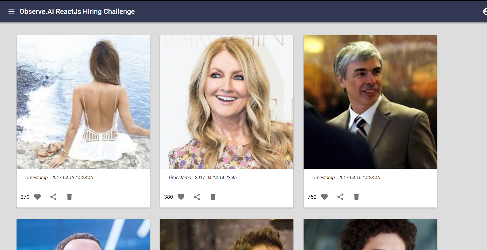

## Quick Overview

Make sure to have nodejs > 8 installed

```sh
cd react-imagecards
npm install
npm start
```

This starts up the app and can be viewed on http://localhost:3000/ 

Initial Screen:

<p align='center'>

</p>


## Brief Explanation of Code

* This application is setup with reactjs and themed in react material UI
* The layout of page is mainly setup in src/components/Home.js on default route
* The BodyArea component displays cards of fetched data
* The data is fetched from server with fetch API and initial state and data of application is then set
* Now the data is loaded into the cards component 

* The cards are responsive and in mid screen changes to 2 per line 
<p align='center'>

</p>
and 1 per line in small screens
<p align='center'>

</p>

* Each card displays the image, timestamp and number of likes. The card has 3 action icons - Like, Share and Delete Icon 
  
* Click on Like Icon in card to increase the like count for the card (Here the like count of first card is increased)
 <p align='center'>

</p> 

* Click on Delete to delete the images 
 <p align='center'>

</p> 